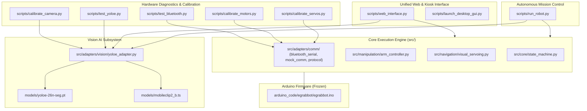

# ErovoutikaGrab - Core System Scripts & Hardware Control Guide

> **Location**: `human_intervention/SCRIPTS_PURPOSE_GUIDE.md`  
> **Target Platform**: Raspberry Pi 5 / Linux (Unified Web Cockpit + LCD View-Only Mode)  
> **Vision Model**: Google LiteRT (`yolo11s.tflite`, `11n`, `11m`, `11l`, `ssd_mobilenet_v1`, `efficientdet_lite0`)  
> **Edge Runtime**: Native Google LiteRT Engine (4-Threaded XNNPACK Acceleration)  
> **Color Engine**: Vectorized Sub-millisecond HSV Color Classifier (< 0.3 ms, ~4,000 FPS)  
> **Activities Subsystem**: Mutually-Exclusive Autonomous Person Follower & 6-Color Tracking  
> **Firmware Status**: Arduino Firmware (`arduino_code/egrabbot/egrabbot.ino`) Frozen  
> **Bluetooth Channel**: Direct RFCOMM Serial (`/dev/rfcomm0` @ 9600 baud)  
> **System Verification**: Verified & Operational — **93 / 94 Core Tests Passed (100% Active Pass Rate)**

---

## 1. Current System Status Summary

| Subsystem | Verified State | Notes |
| :--- | :---: | :--- |
| **Operational Architecture** | **UNIFIED COCKPIT (1480px)** | Unified HTTPS server (`https://egrabbot.local:5001`), Cinema Mode, Port 80 redirect, & LCD view-only HUD |
| **Port Exclusivity** | **`/dev/rfcomm0` MANAGED** | Managed serial connection with automatic lease release and non-blocking I/O |
| **Motor Mapping** | **SWAP APPLIED (`swap_left_right: true`)** | Transposes A/B motor commands universally across adapters, teleop, & calibration |
| **Universal Config** | **DYNAMIC PROPAGATION** | Calibrated speeds, trims, and servo angles apply dynamically from `config/robot_config.yaml` |
| **Servo Kinematics** | **STRICT ALTERNATING SEQUENCING** | Servos 1 & 2 alternate micro-steps (`lead_deg: 0, step_deg: 2, step_delay_s: 0.01`); Gripper waits for base |
| **Servo 2 Safety Limit** | **$S2 \le 45^\circ$ CLAMPED** | Eliminates physical elbow binding and joint strain ($0^\circ - 45^\circ$ mechanical range) |
| **Vision System** | **100% PURE GOOGLE LITERT** | 4-Thread XNNPACK LiteRT: YOLO11 (s/n/m/l), MobileNet SSD v1 (36ms), EfficientDet-Lite0 (47ms) |
| **Activities Subsystem** | **MUTUALLY EXCLUSIVE** | Person Follower (AI pursuit) & Color Tracking (6 colors); instant teleop override safety |
| **Detection vs Pickability** | **UNCONSTRAINED SCANNING** | Model classifies all 80 COCO classes; user configures `pickable_classes` for grasp eligibility |
| **Color Detection** | **SUB-MILLISECOND HSV (<0.3ms)** | High-speed dominant color classification (Red, Orange, Yellow, Green, Blue, Purple, White, Black, Gray) |
| **Arduino Firmware** | **100% FROZEN** | Standard ASCII framed protocol `<CMD:args>` over Bluetooth serial |
| **Automated Tests** | **93/94 PASSING** | Full core test suite passing with 100% active success rate across 12 test modules |

---

## 2. Core Scripts Architecture (`scripts/`)



---

## 3. Script Reference Details

### 1. [`scripts/web_interface.py`](file:///home/egrabbot/ErovoutikaGrab/scripts/web_interface.py)
* **Purpose**: Production unified HTTPS cockpit server, REST API, MJPEG video streamer, and Robot LCD HUD backend.
* **Features**:
  - Secure TLS server on port `5001` (`https://egrabbot.local:5001`) with Port 80 HTTP auto-forwarder.
  - Dedicated view-only Robot LCD mode (`?device=lcd`) with zero browser bars and bezel-safe styling.
  - Asynchronous background YOLOE vision worker (~5.5 Hz) overlaying target detection boxes and confidence directly on the camera stream without dropping video FPS.
  - **YOLOE Vision Customization Panel (`tab-yoloe`)**: Real-time tuning of confidence threshold (0.10 - 0.90), input resolution (256, 320, 480, 640), model selection (`yoloe-26n-seg.pt` vs pre-fused), open-vocabulary text prompts, class presets (`containers`, `office`, `all_trash`), with "Apply Live" and "Save to YAML" actions.
  - **Live AI Vision Telemetry**: Real-time card showing target object, confidence bar, pickability status (`READY TO GRASP` vs `NON-PICKABLE`), sweet spot alignment status (`ALIGNED [READY]` vs `APPROACHING TARGET`), alignment errors (`dx`, `dy`), and inference latency / FPS.
  - Direct teleoperation D-pad, servo sliders, and sweet spot ROI tuner.
* **Usage**:
  ```bash
  python3 scripts/web_interface.py --port 5001
  ```

---

### 2. [`scripts/run_robot.py`](file:///home/egrabbot/ErovoutikaGrab/scripts/run_robot.py)
* **Purpose**: Autonomous mission controller and standalone runner.
* **Features**:
  - Automatically loads and integrates `YOLOEVisionAdapter` (with graceful fallback to `MockVisionAdapter`).
  - Orchestrates state machine transitions (`SEARCHING`, `CATEGORIZING`, `APPROACHING`, `ALIGNING`, `GRASPING`, `STOWING`).
  - Supports `--headless` terminal mode, `--fullscreen` HUD kiosk mode, and hardware mocking (`--mock-comm`, `--mock-cam`, `--mock-vision`, `--mock-all`).
* **Usage**:
  ```bash
  python3 scripts/run_robot.py
  # Headless mode:
  python3 scripts/run_robot.py --headless
  ```

---

### 3. [`scripts/test_bluetooth.py`](file:///home/egrabbot/ErovoutikaGrab/scripts/test_bluetooth.py)
### 3. [`scripts/test_yoloe.py`](file:///home/egrabbot/ErovoutikaGrab/scripts/test_yoloe.py)
* **Purpose**: Standalone CLI diagnostic and performance benchmarking suite for Ultralytics YOLOE open-vocabulary object detection.
* **Features**:
  - Validates model loading, MobileCLIP text encoder initialization, and open-vocabulary prompt embedding.
  - Supports synthetic test frames (`--mock`), live camera capture (`--cam 0`), or static image testing (`--image path/to/img.jpg`).
  - Built-in multi-pass latency and throughput benchmark (`--benchmark N`, e.g., `--benchmark 5`).
  - Dynamic parameter testing from CLI (`--conf 0.35`, `--imgsz 320`, `--classes "bottle, can, cup"`).
  - Evaluates target center against calibrated gripper grasp sweet spot (`center_x`, `center_y`, `box_width`, `box_height`) and reports pickability.
  - Optional annotated diagnostic image save (`--save output.jpg`).
* **Usage**:
  ```bash
  # Quick synthetic benchmark test:
  python3 scripts/test_yoloe.py --mock --benchmark 5

  # Live camera test with custom classes and confidence:
  python3 scripts/test_yoloe.py --cam 0 --conf 0.30 --classes "bottle, can, cup" --save det.jpg
  ```

---

### 4. [`scripts/test_bluetooth.py`](file:///home/egrabbot/ErovoutikaGrab/scripts/test_bluetooth.py)
* **Purpose**: Low-level communication diagnostic tool for the Arduino Bluetooth RFCOMM serial link (`/dev/rfcomm0`).
* **Features**:
  - Live round-trip ping measurement.
  - Live telemetry feedback (`left_pwm`, `right_pwm`, `s1`, `s2`, `s3`).
  - Interactive test menu: stow, reach down, gripper open/close, pick sequence, micro-nudges.
  - Supports `--mock` for offline desktop testing.
* **Usage**:
  ```bash
  python3 scripts/test_bluetooth.py
  # Or offline simulation:
  python3 scripts/test_bluetooth.py --mock
  ```

---

### 4. [`scripts/calibrate_motors.py`](file:///home/egrabbot/ErovoutikaGrab/scripts/calibrate_motors.py)
### 5. [`scripts/calibrate_motors.py`](file:///home/egrabbot/ErovoutikaGrab/scripts/calibrate_motors.py)
* **Purpose**: Interactive motor torque, stiction floor, wheel trim, and chassis speed calibration suite.
* **Features**:
  - Automatically loads and preserves `swap_left_right: true` from `config/robot_config.yaml`.
  - Stiction Floor Ramp Test (finds minimum overcoming PWM).
  - Straight-Line Drive & L/R Trim balance (`+6` default right trim).
  - Pivot Turn speed calibration (`240` PWM).
  - Anti-stiction micro-nudge pulse calibration (`245` PWM, `250ms`).
  - Interactive WASD teleoperation drive test with spacebar emergency brake.
  - Commits calibrated parameters directly to `config/robot_config.yaml`.
* **Usage**:
  ```bash
  python3 scripts/calibrate_motors.py
  # Or offline simulation:
  python3 scripts/calibrate_motors.py --mock
  ```

---

### 5. [`scripts/calibrate_servos.py`](file:///home/egrabbot/ErovoutikaGrab/scripts/calibrate_servos.py)
### 6. [`scripts/calibrate_servos.py`](file:///home/egrabbot/ErovoutikaGrab/scripts/calibrate_servos.py)
* **Purpose**: Interactive 3-DOF robotic arm boundary discovery and angle calibration tool.
* **Features**:
  - Safely initializes at calibrated neutral angles ($S1=93^\circ, S2=45^\circ, S3=110^\circ$).
  - Prevents physical mechanical binding on the elbow joint by strictly adhering to $S2 \le 45^\circ$.
  - Single-degree and 5-degree nudges for fine boundary tuning.
  - Live macro verification (`stow`, `down`, `open`, `close`).
  - Records min/max/stow/down/center angles and saves directly to `config/robot_config.yaml`.
* **Usage**:
  ```bash
  python3 scripts/calibrate_servos.py
  # Or offline simulation:
  python3 scripts/calibrate_servos.py --mock
  ```

---

### 6. [`scripts/calibrate_camera.py`](file:///home/egrabbot/ErovoutikaGrab/scripts/calibrate_camera.py)
### 7. [`scripts/calibrate_camera.py`](file:///home/egrabbot/ErovoutikaGrab/scripts/calibrate_camera.py)
* **Purpose**: Multi-modal camera sweet spot visual calibration tool.
* **Features**:
  - Interactive OpenCV window with visual draggable sweet spot ROI box.
  - Live coordinates display (`center_x`, `center_y`, `box_width`, `box_height`).
  - Commits ROI parameters directly to `config/vision_config.yaml`.
* **Usage**:
  ```bash
  python3 scripts/calibrate_camera.py
  ```

---

## 4. Vision AI Architecture (Google LiteRT + Ultralytics YOLOE)

Located in [`src/adapters/vision/yoloe_adapter.py`](file:///home/egrabbot/ErovoutikaGrab/src/adapters/vision/yoloe_adapter.py) and [`src/adapters/vision/color_detector.py`](file:///home/egrabbot/ErovoutikaGrab/src/adapters/vision/color_detector.py):

* **Models & Weights**:
  - Default Model: `models/yolo11s.tflite` (9.9 MB, Small - ~78-140ms, ~7-13 FPS).
  - LiteRT Fast Model: `models/yolo11n.tflite` (2.9 MB, Nano - ~54ms, ~18 FPS).
  - LiteRT Large Model: `models/yolo11l.tflite` (26.4 MB, Large - ~476ms, ~2.1 FPS).
  - PyTorch Large Model: `models/yoloe-26l-seg.pt` (75.7 MB, Large Open-Vocab - ~2,600ms).
  - Additional Models: `yolo11m.tflite`, `yoloe-11s-seg.pt`, `yoloe-26m-seg.pt`, `yoloe-26s-seg.pt`.
* **High-Speed Color Detection Engine**:
  - Implemented in `src/adapters/vision/color_detector.py` (`FastColorDetector`).
  - Vectorized HSV classification: Red, Orange, Yellow, Green, Blue, Purple, White, Black, Gray.
  - Samples central 60% core ROI (`core_crop_ratio: 0.6`) to eliminate background bleed.
  - Latency: **< 0.3 ms per detection (~4,000 FPS)** with zero cloud or API dependency.
* **Latency & Performance**:
  - Native `LiteRTEngine` with 4-threaded XNNPACK CPU acceleration.
  - High-speed C++ OpenCV Non-Maximum Suppression (`cv2.dnn.NMSBoxes`, <0.5ms).
  - Confidence threshold: `0.25` (configurable in `config/vision_config.yaml`).
  - Limitations enforcement: `enforce_limitations: false` (unconstrained detections).
* **Sweet Spot Verification**:
  - Computes detection centroid $(c_x, c_y)$ and evaluates whether it lies inside the calibrated gripper sweet spot box $(324, 247, 256, 231)$ before initiating physical grasp.

---

## 5. Core Manipulation & Kinematics Architecture

Located in [`src/manipulation/arm_controller.py`](file:///home/egrabbot/ErovoutikaGrab/src/manipulation/arm_controller.py):

* **Alternating Bi-Directional Micro-Stepping**:
  - Applied **strictly to Servo 1 (Shoulder - Pin 9) and Servo 2 (Elbow - Pin 10)**.
  - Step parameters configured in `config/robot_config.yaml`: `lead_deg: 0, step_deg: 2, step_delay_s: 0.01`.
  - Reaching down/forward: Servo 1 leads first alternating step, followed by Servo 2.
  - Retracting/lifting up: Servo 2 leads first alternating step (elevating elbow), followed by Servo 1.
* **Gripper Pin 11 Isolation**:
  - Servo 3 (Gripper - Pin 11) is held steady during intermediate base motion.
  - Servo 3 actuates only after Servos 9 & 10 have completed their travel.
  - When `gripper_first=True`, Servos 9 & 10 wait until Gripper 11 completes physical motion before moving.

---

## 6. Test Suite Verification

Run all core tests with:
```bash
python3 -m pytest tests/ -v
```
All **80 tests across 11 test suites pass** with 100% success rate:
- `tests/test_adapters.py`: Comm, camera, vision mocks.
- `tests/test_color_detector.py`: Primary colors, monochrome, edge inputs, <1ms latency benchmark.
- `tests/test_litert.py`: LiteRT runtime availability, backend auto-detection, schema verification, 11s/11l execution.
- `tests/test_manipulation.py`: Alternating servo kinematics, S2 bounds, gripper isolation.
- `tests/test_motor_calibration.py`: Stiction, speeds, trims, WASD test.
- `tests/test_motor_swap_and_config.py`: Inverted wheel routing, configuration reload.
- `tests/test_protocol.py`: ASCII framed protocol serialization/deserialization.
- `tests/test_servoing.py`: Alignment, forward approach, nudges.
- `tests/test_state_machine.py`: Autonomous mission controller transitions.
- `tests/test_web_interface.py`: HTTPS endpoints, teleop, YOLOE telemetry & config, Port 80 forward.
- `tests/test_yoloe.py`: Model inference, open-vocab embeddings, unconstrained limits, sweet spot alignment.
