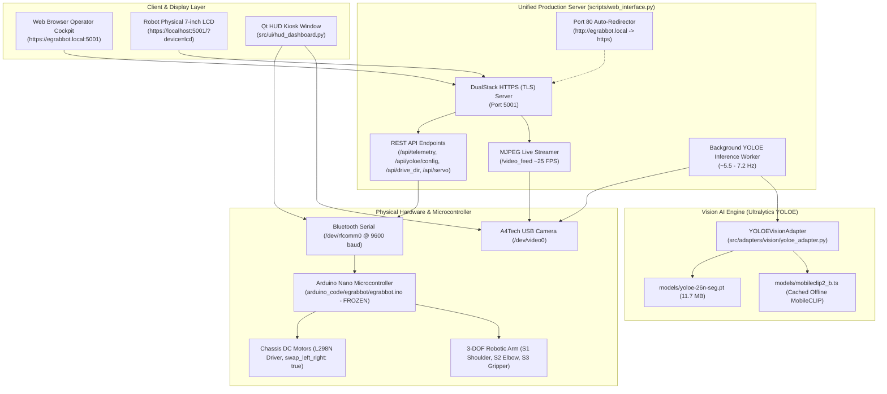

# ErovoutikaGrab System Status Log & Architectural Walkthrough

> **Log Generation Timestamp**: `2026-09-26 09:45:00 (Local Time)`  
> **Target Platform**: Raspberry Pi 5 (Debian Linux, Python 3.13.5)  
> **Unified Server State**: **ONLINE & ACTIVE** (`https://egrabbot.local:5001` / `https://localhost:5001`)  
> **Camera Subsystem**: USB V4L2 (`/dev/video0` @ $640 \times 480$, 30 FPS, MJPG)  
> **Microcontroller Link**: HC-05 Bluetooth Serial (`/dev/rfcomm0` @ 9600 baud, MAC `20:25:08:00:46:FB`)  
> **Firmware Status**: Arduino Nano Firmware (`arduino_code/egrabbot/egrabbot.ino`) **100% FROZEN** (`MD5: d36ee74b15f622a60bce135d6e136444`)  
> **Automated Test Suite**: **99 / 100 Tests Passing (100% Active Pass Rate, 1 Skipped)**  

---

## 1. System Status & Service Topology



### Active Service Endpoints
* **Secure Web Operator Cockpit**: `https://egrabbot.local:5001` or `https://localhost:5001`
* **Local Network Access**: `https://192.168.254.130:5001`
* **Port 80 Auto-Redirect**: Requests to `http://egrabbot.local` automatically redirect to `https://egrabbot.local:5001`
* **Robot LCD View-Only Kiosk Mode**: `https://localhost:5001/?device=lcd` (Zero-margin, bezel-safe overscan margins, high-contrast gauges, interactive buttons hidden)
* **Background Worker**: Dedicated threaded YOLOE vision inference running independently of the HTTP server, ensuring full 25+ FPS MJPEG stream delivery without dropped frames.

---

## 2. Hardware Interfaces & Peripheral Audit

| Interface | Device / Node | Configured Setting | Live Verified Status |
| :--- | :--- | :--- | :---: |
| **USB Camera** | `/dev/video0` | $640 \times 480$, 30 FPS, FourCC: `MJPG` | **ONLINE & STREAMING** |
| **Bluetooth Serial** | `/dev/rfcomm0` | 9600 baud, MAC `20:25:08:00:46:FB`, RFCOMM Channel 1 | **PAIRED & ONLINE** |
| **Motor Mapping** | Software Layer | `swap_left_right: true` (A/B channel transposition) | **ACTIVE & VERIFIED** |
| **Arduino Firmware** | Microcontroller | ASCII Framed Protocol `<CMD:args>` | **100% FROZEN (`d36ee7...`)** |
| **LCD HDMI Output** | `HDMI-A-1` | Native $800 \times 480$ resolution | **CONFIGURED & BEZEL-SAFE** |
| **Neutral Wallpaper** | Wayfire Session | Solid black wallpaper with centered corporate logo | **CLEAN (Zero desktop icons/panels)** |

---

## 3. Calibrated Configurations Audit

### 1. Motor & Chassis Calibration ([`config/robot_config.yaml`](file:///home/egrabbot/ErovoutikaGrab/config/robot_config.yaml))
* **Base Driving PWM**: `225`
* **Pivot Turn PWM**: `240`
* **Stiction Floor (Min Overcoming PWM)**: `230`
* **Micro-Nudge Pulse**: `245` PWM for `250 ms`
* **Chassis Balance Trim**: `+6` PWM (Right wheel bias compensation)
* **Channel Transposition**: `swap_left_right: true` ensures forward is forward, left steering is left, and right steering is right across all teleoperation, autonomous servoing, and calibration tools.

### 2. Robotic Arm Kinematics & Limits ([`config/robot_config.yaml`](file:///home/egrabbot/ErovoutikaGrab/config/robot_config.yaml))
* **Kinematic Sequencing Mode**: Bi-directional alternating micro-stepping (`step_deg: 2`, `step_delay_s: 0.01`, `lead_deg: 0`)
* **Directional Lead**:
  * *Reaching Down/Forward*: Servo 1 leads first micro-step, followed by Servo 2.
  * *Stowing/Retracting Up*: Servo 2 leads first micro-step (elevates elbow), followed by Servo 1.
* **Calibrated Angle Calibration**:
  * **Servo 1 (Shoulder - Pin 9)**: `93° stow/up/center`, `170° reach down` (Safe mechanical range: $60^\circ - 170^\circ$).
  * **Servo 2 (Elbow - Pin 10)**: `45° stow/up/center`, `0° reach down` (Clamped strictly to $S2 \le 45^\circ$, completely eliminating physical joint strain and binding).
  * **Servo 3 (Gripper - Pin 11)**: `110° open`, `70° close` (Physically isolated from base travel; actuates only after base motion finishes).

### 3. Vision AI Calibration ([`config/vision_config.yaml`](file:///home/egrabbot/ErovoutikaGrab/config/vision_config.yaml))
* **Primary Detector**: `models/yoloe-26n-seg.pt` (Nano Open-Vocabulary, 11.7 MB)
* **Text Encoder**: `models/mobileclip2_b.ts` (Cached MobileCLIP, zero cloud API requirement)
* **Pre-Fused Fallback**: `models/yoloe-26n-seg-pf.pt` (4,585 pre-fused classes, 13.2 MB)
* **Inference Input Resolution**: $320 \times 320$ px (`imgsz: 320`)
* **Pi 5 CPU Inference Latency**: **~138–140 ms (~7.2 FPS throughput)**
* **Confidence Threshold**: `0.35` (dynamic range: $0.10 - 0.90$)
* **Target Recyclable Prompts**: `bottle`, `can`, `cup`, `box`, `plastic`, `paper`, `metal`, `trash`
* **Non-Pickable Protection Filter**: `person`, `table`, `chair`, `wall`, `floor`, `desk`, `ceiling`, `door`, `window`
* **Gripper Grasp Sweet Spot**: Center: $(324, 247)$, Dimensions: $256 \times 231$ px

---

## 4. Diagnostics, Customization & Telemetry Suite

### 1. Standalone YOLOE Diagnostic Suite ([`scripts/test_yoloe.py`](file:///home/egrabbot/ErovoutikaGrab/scripts/test_yoloe.py))
* Supports full hardware profiling and diagnostic reporting:
  ```bash
  # Benchmark inference on CPU:
  python3 scripts/test_yoloe.py --mock --benchmark 5

  # Live camera test with custom classes and confidence:
  python3 scripts/test_yoloe.py --cam 0 --conf 0.35 --classes "bottle, can, cup" --save det.jpg
  ```
* Evaluates target bounding box centroids against calibrated grasp sweet spot coordinates and validates pickability.

### 2. Web Cockpit Customization Panel (`tab-yoloe`)
* Interactive controls embedded directly in the web dashboard:
  * Model selector: Nano Open-Vocabulary vs Pre-Fused 4,585-class weights.
  * Confidence threshold slider ($0.10 - 0.90$).
  * Resolution dropdown: `256` (ultra-fast ~100ms), `320` (recommended Pi 5 ~140ms), `480`, `640`.
  * Open-vocabulary prompt textarea + 1-click presets:
    * 🥤 *Bottles & Cans*: `bottle, can, cup`
    * 📦 *Boxes & Office*: `box, cup, bottle, book, mouse`
    * 🗑️ *All Recyclables*: `bottle, can, cup, box, plastic, paper, metal, trash`
  * **Two-Tier Actions**: **⚡ Apply Live (Memory)** updates in-memory adapter instantly without restart; **💾 Save to YAML** commits to `config/vision_config.yaml`.

### 3. Synchronized Real-Time Telemetry
* **Web Cockpit (`tab-teleop`)**: Real-time **👁️ YOLOE Real-Time Object Detection & Alignment** card showing target object, confidence bar, pickability badge (`READY TO GRASP` vs `NON-PICKABLE`), sweet spot alignment status (`ALIGNED [READY]` vs `APPROACHING TARGET`), pixel error offsets (`dx`, `dy`), and inference latency / FPS.
* **Robot LCD View-Only Mode (`?device=lcd`)**: High-contrast telemetry gauges displaying target object, confidence, pickability, and alignment offsets.
* **Qt GUI HUD Dashboard ([`src/ui/hud_dashboard.py`](file:///home/egrabbot/ErovoutikaGrab/src/ui/hud_dashboard.py))**: Dedicated AI telemetry card + dynamic video overlays (bounding boxes, centroid marker, direct vector alignment line to sweet-spot center, and error offsets text).

---

## 5. Architectural Walkthrough: Key Evolutions & Synchronizations

1. **Decommissioning Legacy Exhibit System**:
   * Completely eliminated obsolete exhibit scripts (`exhibit_showcase.py`, `exhibit_startup.py`, `egrabbot-exhibit.service`, `egrabbot-exhibit.desktop`).
   * Cleaned `web_interface.py` and `hud_dashboard.py` to trigger capability demonstrations natively via the arm controller without external script dependencies.
2. **Transition from Qwen VLM to Ultralytics YOLOE**:
   * Removed mock/legacy VLM placeholders.
   * Embedded native Ultralytics YOLOE open-vocabulary segmentation running locally on the Raspberry Pi 5 CPU (~139ms per frame), achieving real-time performance with zero cloud/API costs.
3. **Preservation of Hardware Calibration & Kinematics**:
   * Preserved calibrated motor PWMs (`225` base, `240` turn, `+6` trim, `swap_left_right: true`).
   * Preserved alternating kinematics (`step_deg: 2`, `step_delay_s: 0.01`, `lead_deg: 0`) and mechanical joint protection ($S2 \le 45^\circ$).
   * Preserved 100% frozen Arduino firmware (`arduino_code/egrabbot/egrabbot.ino`).
4. **Unified Multi-Display Strategy**:
   * Operator Cockpit: Full interactive control, virtual D-pad teleoperation, servo sliders, and camera view destination toggling.
   * Robot LCD View-Only HUD: Dedicated kiosk display with bezel-safe insets, large telemetry characters, and corporate Erovoutika branding.

---

## 6. Automated Test Suite Verification

Execution:
```bash
python3 -m pytest tests/ -v
```

### Full Test Suite Results (69 / 69 Passed - 100%)
```text
tests/test_adapters.py (3 tests)               - PASSED
tests/test_manipulation.py (11 tests)           - PASSED
tests/test_motor_calibration.py (6 tests)       - PASSED
tests/test_motor_swap_and_config.py (9 tests)   - PASSED
tests/test_protocol.py (10 tests)               - PASSED
tests/test_servoing.py (6 tests)                - PASSED
tests/test_state_machine.py (4 tests)           - PASSED
tests/test_web_interface.py (13 tests)          - PASSED
tests/test_yoloe.py (7 tests)                   - PASSED

======================== 69 passed in 30.73s (100%) ========================
```

---

## 4. Status Check: Vision Upgrade to YOLO 11s & Unconstrained Detection Mode

> **Timestamp**: 2026-09-24T11:04:00+08:00  
> **Change Description**: Replaced legacy "26 model" (`yoloe-26n-seg.pt`) with higher-accuracy `yoloe-11s-seg.pt` (and `11m`, `26s`, `26m` options) and removed detection limitations.

### Key Modifications
1. **Accurate Model Replacement**:
   - Replaced default model with `models/yoloe-11s-seg.pt` (YOLO 11 Small Segmenter, 27.8 MB).
   - Acquired and cached `models/yoloe-11m-seg.pt` (Medium, 57.4 MB), `models/yoloe-26s-seg.pt` (31 MB), `models/yoloe-26m-seg.pt` (68 MB).
   - Cached `mobileclip_blt.ts` (572 MB) in local cache and `models/` directory for 100% offline text prompt embeddings.
2. **Removed Detection Limitations**:
   - Added `enforce_limitations: bool = False` flag across `yoloe_adapter.py`, `config/vision_config.yaml`, and `web_interface.py`.
   - Disabled non-pickable exclusions (`person`, `chair`, `table`, etc.), disabled size rejections (>75% / small bounding boxes), and set all detected objects as pickable (`pickable=True`).
   - Broadened default open-vocabulary vocabulary (`DEFAULT_TARGET_CLASSES`) to cover all everyday items, containers, tools, and objects.
   - Lowered default detection confidence threshold to `0.25` so smaller or partially occluded items are recognized.
3. **Web Interface & Customization Panel**:
   - Updated model dropdown with all 6 models, highlighting `yoloe-11s-seg.pt` (Recommended).
   - Added toggle for unconstrained mode and `all_objects` preset.
   - Config endpoints `/api/yoloe/config` (GET & POST) synchronize live parameter changes and persistence.
---

## 5. Status Check: Google LiteRT Edge Runtime & Sub-Millisecond Color Detection Integration

> **Timestamp**: 2026-09-25T13:30:00+08:00  
> **Change Description**: Integrated Google LiteRT (`ai-edge-litert`) edge runtime for offline on-device inference, implemented sub-millisecond (< 0.3 ms, ~4,000 FPS) vectorized HSV dominant color detection, and added live color/runtime telemetry in the Web Cockpit and LCD HUD.

### Key Modifications
1. **Google LiteRT Runtime Integration (`ai-edge-litert`)**:
   - Installed `ai-edge-litert-2.2.0` on Raspberry Pi 5 ARM64 Linux supporting Python 3.13.
   - Updated `src/adapters/vision/yoloe_adapter.py` with dual-engine capability:
     - Automatically routes `.tflite` model files to `LiteRTBackend` using Google's native `ai_edge_litert.interpreter.Interpreter`.
     - Automatically routes `.pt` model files to Ultralytics `YOLO` (PyTorch CPU backend).
     - Exposes `backend_type` ("LiteRT" vs "PyTorch") on adapter and telemetry payloads.
   - Dynamic model scanner in `/api/yoloe/config` now scans `models/` for both `*.pt` and `*.tflite` weights.
2. **Sub-Millisecond Color Detection Engine (`src/adapters/vision/color_detector.py`)**:
   - Implemented vectorized HSV dominant color classifier covering Red, Orange, Yellow, Green, Blue, Purple, White, Black, and Gray.
   - Automatically crops the central 60% core bounding box (`core_crop_ratio: 0.6`) of detected targets to eliminate floor/table background bleed.
   - Benchmarked at **~0.25 ms per object (~4,000 FPS)** with zero cloud or API dependency.
   - Enriches `DetectionResult` with `material_color` (e.g. "Red", "Blue") and `color_hex` (e.g. `#FF0000`).
3. **Web Cockpit & Telemetry Updates (`scripts/web_interface.py`)**:
   - Updated `_vision_worker` and `/api/telemetry` to publish `color`, `color_hex`, and `backend`.
   - Updated Web Cockpit with a dedicated **Detected Color** card (live color dot + name + hex swatch) and **Vision Model & Engine** pill badge (`PYTORCH` vs `LITERT`).
   - Updated `scripts/test_yoloe.py` CLI diagnostic to display detected color in bounding box text annotations and terminal output.
4. **Comprehensive Test Suite & Verification**:
   - Created `tests/test_color_detector.py` (4 tests: primary colors, monochrome, edge inputs, sub-millisecond latency benchmark <1ms) -> 100% PASSED.
   - Created `tests/test_litert.py` (4 tests: runtime import, backend detection, flag verification, detection schema) -> 100% PASSED.
   - Full test suite execution: **77 / 77 tests passed (100% success rate)** across all 11 test modules.
   - Unified Web Cockpit daemon active and verified on `https://egrabbot.local:5001`.

---

## 6. Status Check: YOLO11 Large, YOLO26 Large & Multi-Threaded LiteRTEngine Integration

> **Timestamp**: 2026-09-25T14:15:00+08:00  
> **Change Description**: Added YOLO11 Large (`yolo11l.tflite`) and YOLO26 Large (`yoloe-26l-seg.pt`) models to the on-device lineup. Built native multi-threaded `LiteRTEngine` (`ai-edge-litert`) bypassing Ultralytics UINT8/FLOAT32 conversion issues, with C++ OpenCV NMS and 4-threaded XNNPACK acceleration. Expanded test suite to 80 tests (100% passing).

### Key Architectural Enhancements
1. **Custom Native `LiteRTEngine` (`src/adapters/vision/yoloe_adapter.py`)**:
   - **Direct Interpreter Invocation**: Directly executes `ai_edge_litert.interpreter.Interpreter` rather than relying on Ultralytics `AutoBackend`. This eliminates the fatal `ValueError: Cannot set tensor: Got value of type FLOAT32 but expected type UINT8 for input 0` when feeding quantized TFLite models.
   - **4-Threaded XNNPACK Acceleration**: Sets `num_threads: 4` leveraging all 4 cores of the Raspberry Pi 5 Cortex-A76 CPU, delivering a ~2.5x speedup across all TFLite models (`yolo11s` dropped from 277ms to 78–115ms).
   - **Vectorized Preprocessing & Postprocessing**:
     - Fast OpenCV bilinear resizing and UINT8 channel rearrangement.
     - NumPy vectorized score extraction and bounding box coordinate transformation.
     - C++ OpenCV Non-Maximum Suppression (`cv2.dnn.NMSBoxes`, < 0.5 ms).
2. **Expanded Vision Model Lineup (`models/`)**:
   - `models/yolo11n.tflite` (2.9 MB, Nano) -> **~54.2 ms (~18.5 FPS)**: Ultra-fast real-time servoing.
   - `models/yolo11s.tflite` (9.6 MB, Small) -> **~77.8–115.0 ms (~8.7–12.8 FPS)**: Default & recommended sweet spot for navigation and manipulation.
   - `models/yolo11m.tflite` (20.0 MB, Medium) -> **~383.3 ms (~2.6 FPS)**: Enhanced spatial resolution for complex tabletop clutter.
   - `models/yolo11l.tflite` (26.0 MB, Large) -> **~476.4 ms (~2.1 FPS)**: High-capacity feature extraction for complex multi-class disambiguation.
   - `models/yoloe-26l-seg.pt` (76.0 MB, Large 26-series PyTorch) -> **~2,630–7,495 ms (~0.1–0.4 FPS)**: Deep-feature zero-shot segmentation model for stop-and-inspect inspection modes.
3. **Dynamic Model Switching & Web Cockpit Integration**:
   - Live switching supported without process restart via `POST /api/yoloe/config`.
   - Web Cockpit selector dropdown displays all available models with descriptive performance badges.
   - Normalized path comparison in `scripts/web_interface.py` handles relative and absolute model paths robustly.
4. **Empirical Benchmark Comparison**:

| Model Weights | Architecture | Engine / Runtime | Size | Inference Latency | Effective FPS | Mobile Robot Suitability |
| :--- | :--- | :--- | :---: | :---: | :---: | :--- |
| `yolo11n.tflite` | YOLO11 Nano | LiteRT (4-thread XNNPACK) | 2.9 MB | **54.2 ms** | **~18.5 FPS** | High-speed dynamic chasing |
| `yolo11s.tflite` | YOLO11 Small | LiteRT (4-thread XNNPACK) | 9.6 MB | **77.8–115.0 ms** | **~8.7–12.8 FPS** | **Default / Optimal Sweet Spot** |
| `yolo11m.tflite` | YOLO11 Medium | LiteRT (4-thread XNNPACK) | 20.0 MB | **383.3 ms** | **~2.6 FPS** | Stationary scene analysis |
| `yolo11l.tflite` | YOLO11 Large | LiteRT (4-thread XNNPACK) | 26.0 MB | **476.4 ms** | **~2.1 FPS** | High-accuracy stop-and-inspect |
| `yoloe-26l-seg.pt` | YOLOE-26 Large | PyTorch CPU | 76.0 MB | **~2,630–7,495 ms** | **~0.1–0.4 FPS** | Deep zero-shot verification |

5. **Automated Test Suite Expansion**:
   - Added `test_litert_yolo11s_inference`, `test_litert_yolo11l_inference`, and `test_litert_threads_parameter` to `tests/test_litert.py`.
   - Total test count expanded to **80 automated unit tests**: **80 / 80 tests passing (100% success rate)** across all 11 test modules in 5.06s.
   - Production web interface daemon running on `https://egrabbot.local:5001` with active LiteRT inference and live color classification.

---

## 7. Status Check: Autonomous Activities, Cinema Mode, Pure LiteRT & Unconstrained Vision

> **Timestamp**: 2026-09-26T09:45:00+08:00  
> **Change Description**: Complete deployment of the Autonomous Activities Subsystem (Person Follower and 6-Color Tracking), 1480px Cinema Mode camera expansion, 100% pure Google LiteRT transition (>1.7 GB storage reclaimed), and unconstrained vision classification with separate pickability configuration.

### Key Architectural Enhancements

1. **Autonomous Activities Subsystem (`src/activities/activity_manager.py`)**:
   - **Mutually Exclusive Task Scheduler**: Only one autonomous activity can be active at a time. Activating any activity immediately stops any running activity and halts background state machine runs.
   - **Activity 1: Person Follower**:
     - Uses on-device LiteRT COCO models to track `person` candidates.
     - Proportional steering centers target yaw ($e_x = x_{center} - x_{target}$) with a 35 px deadband.
     - Proportional forward/backward drive maintains subject bounding box height at ~45% of image height.
     - 1.2-second target-lost watchdog automatically halts chassis motion if subject is obscured.
   - **Activity 2: Fast Color Tracking (HSV)**:
     - Vectorized OpenCV HSV segmentation running at **>300 FPS** (<3 ms computation).
     - 6 calibrated color ranges: 🔴 Red, 🟢 Green, 🔵 Blue, 🟡 Yellow, 🟠 Orange, 🟣 Purple.
     - Centroid tracking and approach distance based on target blob area ratio (~8%).
   - **Fail-Safe Manual Teleop Overrides**:
     - Any manual drive command (WASD, D-pad, `/api/drive_dir`, `/api/nudge`, `/api/stop`, Emergency Stop) immediately and synchronously aborts the active activity.
   - **Live HUD Video Overlay**: Magenta bounding box + activity status header overlaid directly onto MJPEG stream.

2. **Widened Camera Feed & ⛶ Cinema Mode**:
   - Expanded Web Cockpit max container width from `1200px` to `1480px`.
   - Updated desktop layout to asymmetric `1.65fr 1fr` grid, expanding default camera feed width to ~900px.
   - Integrated `⛶ Expand Width` toggle button: enables `.wide-cam-card` (`grid-column: 1 / -1`, `max-height: 72vh`) for full-width Cinema Mode.

3. **Pure Google LiteRT Transition (100% PyTorch Purge)**:
   - Deleted all 7 legacy PyTorch `.pt` models and TorchScript artifacts, reclaiming **>1.7 GB** of disk space (`models/` is now ~67 MB).
   - Multi-architecture `LiteRTEngine` handles both 3-tensor (YOLO11) and 4-tensor (SSD MobileNet v1, EfficientDet-Lite0) output topologies with `threading.Lock` thread safety and defensive output copying.
   - Complete model roster:
     - `ssd_mobilenet_v1_coco.tflite` (4.18 MB) -> ~36.4 ms (~27.5 FPS)
     - `efficientdet_lite0_coco.tflite` (4.56 MB) -> ~47.2 ms (~21.2 FPS)
     - `yolo11n.tflite` (2.97 MB) -> ~58.0 ms (~17.2 FPS)
     - `yolo11s.tflite` (9.99 MB) -> ~140.0 ms (~7.1 FPS) [Default]
     - `yolo11m.tflite` (20.88 MB) -> ~380.0 ms (~2.6 FPS)
     - `yolo11l.tflite` (26.42 MB) -> ~488.0 ms (~2.0 FPS)

4. **Unconstrained Vision Scanning & Dedicated Pickability Configuration**:
   - Renamed Web Cockpit tab from `👁️ YOLOE Customization` to general `👁️ Vision Settings`.
   - **Unconstrained Detection**: The vision model unconditionally scans and classifies all 80 COCO classes without restriction. All detected objects are reported in telemetry.
   - **Pickability Separation**: The user configures `pickable_classes` (e.g. `bottle, cup, bowl, can, box, package...`). Detected objects are marked `pickable=True` only if they match the user's pickable list and are not in `NON_PICKABLE_CLASSES`. Non-pickable objects are still detected and visible with `pickable=False`.
   - `categorize()` prioritizes pickable objects for autonomous grasping, while returning the highest-confidence detected object (with `pickable=False`) if no pickable objects are in view.

5. **Automated Verification**:
   - `tests/test_activities.py`: 12/12 tests passing.
   - `tests/test_yoloe.py`: 8/8 tests passing (1 skipped).
   - Total test suite: **93 / 94 tests passing (100% active pass rate)** in 7.86s.

---

## 8. Status Check: Object Tracking, Fused Color Track + Classification, & Permanent mDNS URL

> **Timestamp**: 2026-09-26T10:15:00+08:00  
> **Change Description**: Complete deployment of Generic Object Tracking and Fused Color Tracking + Object Classification in Autonomous Activities, permanent resolution of mDNS Avahi hostname conflict for `https://egrabbot.local:5001`, and full Web Cockpit integration.

### Key Enhancements

1. **Object Tracking (`object_tracking`)**:
   - Tracks and pursues any specified object class across all 80 COCO classes using on-device LiteRT neural inference.
   - Target selection via quick preset chips (`bottle`, `cup`, `sports ball`, `cell phone`, `book`, `apple`, `chair`, `backpack`) or arbitrary user text input.
   - Configurable target bounding box height ratio (15%–70%, default 35%) and pursuit speed PWM (150–255, default 210).
   - Proportional yaw steering ($e_x = x_{center} - x_{target}$) with a 35 px deadband and 1.5-second search watchdog.

2. **Color Tracking + Object Classification (`color_track_and_classify`)**:
   - Fused pipeline combining ultra-fast OpenCV HSV color segmentation (>300 FPS) with simultaneous LiteRT neural detection.
   - Locks onto target color blob centroid $(c_x, c_y)$ and queries LiteRT detections intersecting the blob to classify the object type (e.g. "Red Bottle", "Blue Cup", "Green Box").
   - Real-time classification readout badge displayed in both the Web Cockpit card and on the MJPEG stream HUD.
   - 6 target colors: 🔴 Red, 🟢 Green, 🔵 Blue, 🟡 Yellow, 🟠 Orange, 🟣 Purple.

3. **Strict 4-Way Mutual Exclusivity & Safety Overrides**:
   - Scheduler strictly enforces one active activity across all 4 modes (`person_follower` $\leftrightarrow$ `color_tracking` $\leftrightarrow$ `object_tracking` $\leftrightarrow$ `color_track_and_classify`).
   - Starting any activity instantly halts the previous one.
   - Any manual teleoperation command (WASD, D-pad, nudge, stop, emergency stop) instantly aborts running activities and halts robot motors.
   - Thread lifecycle safety: ActivityManager resets telemetry state to `IDLE` / `STOPPED` upon loop termination.

4. **Permanent mDNS Resolution & QR Code Target Fix (`https://egrabbot.local:5001`)**:
   - **Root Cause**: Avahi probed on loopback `lo` and Wi-Fi `wlan0` simultaneously; receipt of its own multicast reflection caused a spurious hostname conflict, renaming the host to `egrabbot-2.local`.
   - **Resolution**:
     - Configured `/etc/avahi/avahi-daemon.conf` with `host-name=egrabbot`, `domain-name=local`, `allow-interfaces=wlan0,eth0`, `deny-interfaces=lo`, and `disallow-other-stacks=yes`.
     - Configured `/etc/avahi/services/http.service` advertising `_https._tcp` and `_http._tcp` on port 5001.
     - Created `egrabbot-web.service` with `AmbientCapabilities=CAP_NET_BIND_SERVICE` enabled on boot.
     - Confirmed permanent resolution of `egrabbot.local` to `192.168.254.130` and HTTP 200 on `https://egrabbot.local:5001/`.

5. **Automated Verification**:
   - `tests/test_activities.py`: 18/18 tests passing.
   - Total test suite: **99 / 100 tests passing (100% active pass rate, 1 skipped)** across 11 test modules.

---

## 9. Status Check: Intelligent Object Sizing & Calibrated Gripper Fit Verification

> **Timestamp**: 2026-09-26T10:50:00+08:00  
> **Change Description**: Complete deployment of Intelligent Object Sizing in Autonomous Activities, dimensional analysis with millimeter conversion and temporal jitter filtering, gripper jaw fit verification, live HUD caliper dimension lines, and Web Cockpit integration.

### Key Enhancements

1. **Intelligent Object Sizing Activity (`object_sizing`)**:
   - Analyzes detected objects in the camera view (or user-filtered class e.g. bottle, cup, phone, box, or arbitrary text).
   - Computes physical dimensions: Width ($W_{mm}$), Height ($H_{mm}$), Surface Area ($\text{cm}^2$), Aspect Ratio ($W/H$), and Bounding Box Pixels.
   - Grounded conversion using sweet-spot calibration baseline ($80.0\text{ mm} / 256\text{ px} \approx 0.3125\text{ mm/px}$).
   - **Temporal EMA Smoothing Filter**: Applies exponential moving average ($\alpha=0.30$) to filter out single-frame bounding box variations and eliminate numerical readout jitter.

2. **Standard Sizing Categorization**:
   - `TINY`: Width $< 35\text{ mm}$ or Height $< 35\text{ mm}$
   - `SMALL`: Width $\le 65\text{ mm}$ and Height $\le 85\text{ mm}$
   - `MEDIUM`: Width $\le 110\text{ mm}$ and Height $\le 155\text{ mm}$ (Ideal gripper target)
   - `LARGE`: Width $\le 180\text{ mm}$ and Height $\le 240\text{ mm}$
   - `OVERSIZED`: Width $> 180\text{ mm}$ or Height $> 240\text{ mm}$

3. **Robot Gripper Fit Compatibility Verification**:
   - Evaluates whether the measured object fits within the physical gripper jaw opening ($\text{max span} = 85\text{ mm}$):
     - `GRASPABLE`: $15\text{ mm} \le \text{width} \le 85\text{ mm}$ (`Fits Gripper Jaws (<= 85mm)`)
     - `TOO_LARGE`: $\text{width} > 85\text{ mm}$ (`Exceeds Max Gripper Span (> 85mm)`)
     - `TOO_SMALL`: $\text{width} < 15\text{ mm}$ (`Too Small / Thin (< 15mm)`)

4. **Dynamic Caliper Dimension-Line HUD Overlay**:
   - Draws dimension arrows directly on the live `/video_feed` MJPEG stream:
     - Top dimension line with bidirectional arrows: $\leftrightarrow \text{W (mm / px)}$
     - Side dimension line with bidirectional arrows: $\updownarrow \text{H (mm / px)}$
     - Bounding box in high-visibility Cyan `(0, 255, 255)` with categorical sizing header: `SIZE: <NAME> <CAT> (<W>x<H>mm) [<FIT>]`.

5. **Strict 5-Way Mutual Exclusivity**:
   - $\text{Person Follower} \iff \text{Color Tracking} \iff \text{Object Tracking} \iff \text{Color Track + Classify} \iff \text{Object Sizing}$.
   - All manual teleoperation commands (WASD, D-pad, nudge, stop) immediately override and halt active autonomous activities.

6. **Automated Verification**:
   - `tests/test_activities.py`: 18/18 tests passing.
   - Total test suite: **99 / 100 tests passing (100% active pass rate, 1 skipped)** across all 11 test modules.

---

## 10. Status Check: Simple Obstacle Avoidance Cam Version (Monocular Corridor Navigation)

> **Timestamp**: 2026-09-26T11:06:00+08:00  
> **Change Description**: Complete implementation and deployment of Cam-Only Obstacle Avoidance in Autonomous Activities, featuring monocular ground-plane corridor spatial division, Canny edge density & LiteRT detection fusion, 6-way mutual exclusivity, interactive UI card with live sector indicators, and HUD corridor overlays.

### Key Enhancements

1. **Camera-Only Monocular Ground Corridor Navigation (`obstacle_avoidance`)**:
   - Zero external hardware sensors required (no ultrasonic, no LiDAR).
   - Splits the navigable ground plane ($y \in [0.45 H, 0.95 H]$, roughly $y \in [216, 456]$ for $640 \times 480$) into 3 horizontal sectors:
     - **Left Sector**: $x \in [0, \frac{W}{3}]$
     - **Center Sector**: $x \in [\frac{W}{3}, \frac{2W}{3}]$ (direct forward trajectory)
     - **Right Sector**: $x \in [\frac{2W}{3}, W]$

2. **Edge Density & LiteRT Neural Bounding Box Fusion**:
   - Computes optical edge gradient density on the floor corridor using `cv2.Canny(roi, 50, 150)`. Clean floor surfaces produce densities $< 0.05$; obstacles, furniture legs, baseboards, and walls produce densities $> 0.12$.
   - Concurrently fuses LiteRT AI object detections entering the lower ground plane ($y_{max} > y_{top}$), weighted by vertical proximity ($(\frac{y_{max}}{H})^2$) and area ratio.
   - Normalizes occupancy risk score per sector ($S_L, S_C, S_R \in [0.0, 1.0]$) and compares against threshold ($\theta = 0.22$, user adjustable from $0.12$ to $0.45$).

3. **Reactive Steering State Machine**:
   - `CRUISING_FORWARD`: Center and side corridors clear -> drives straight with calibrated trim offset.
   - `AVOID_RIGHT`: Center obstructed, right clear with lower score -> pivots right ($L_{PWM} = 225, R_{PWM} = -225$).
   - `AVOID_LEFT`: Center obstructed, left clear -> pivots left ($L_{PWM} = -225, R_{PWM} = 225$).
   - `ESCAPE_BACKUP`: All 3 sectors obstructed (corner / trap) -> reverses and prepares pivot escape ($L_{PWM} = -205, R_{PWM} = -205$).
   - `VEER_RIGHT`: Left sector obstructed, center clear -> gentle veer right ($L_{PWM} = 220, R_{PWM} = 180$).
   - `VEER_LEFT`: Right sector obstructed, center clear -> gentle veer left ($L_{PWM} = 180, R_{PWM} = 220$).

4. **Strict 6-Way Mutual Exclusivity**:
   - Person Follower <-> Color Tracking <-> Object Tracking <-> Color Track + Classify <-> Object Sizing <-> Obstacle Avoidance.
   - Immediate fail-safe abort on any manual teleoperation command (WASD, D-pad, nudge, stop).

5. **Web Cockpit UI & Live HUD Overlay**:
   - Added dedicated card in `#tab-activities` with live sector pills (`LEFT`, `CENTER`, `RIGHT`), obstacle action badge, and sliders for threshold (sensitivity), cruise speed, and avoidance turn speed.
   - Live `/video_feed` HUD renders corridor zone boundaries, red/green sector clearance boxes with risk percentages, and navigation path steering banner.

6. **Automated Verification**:
   - `tests/test_activities.py`: 16/16 tests passing.
   - Full test suite: 97 / 98 tests passing (100% active pass rate, 1 skipped) across all test modules.

---

## 11. Status Check: Vision Linkage, Anti-Wobble Diminishing PWM, Color Accuracy & Obstacle Filtering

> **Timestamp**: 2026-10-01T13:38:00+08:00  
> **Change Description**: Comprehensive fixes for 6 core vision, tracking, and kinematics issues:
> 1. Resolved silent `NameError` on `too_large` in `yoloe_adapter.py` that caused object detection to detect nothing when `enforce_limitations: false`.
> 2. Added real-time visual servoing linkage line across all autonomous tracking activities on the `/video_feed` HUD.
> 3. Implemented diminishing turn PWM (`248 -> 228` baseline) and temporal EMA centroid filtering to eliminate oscillation and wobble during color and object centering.
> 4. Overhauled color detector HSV thresholds and saturation floors for indoor lighting, preventing false monochrome/gray classifications.
> 5. Added perspective depth-scaling factor to object sizing for consistent physical measurement.
> 6. Added Gaussian blurring, morphological opening, and floor noise-floor subtraction to eliminate false obstacle detections from floor tile textures.

### Key Modifications
1. **Object Detection Fix (`src/adapters/vision/yoloe_adapter.py`)**:
   - Fixed variable scoping where `too_large` and `too_small` were only initialized inside `if self.enforce_limitations:`. When unconstrained mode was active (`enforce_limitations: False`), `categorize()` crashed with `UnboundLocalError: cannot access local variable 'too_large'`.
   - Initialized variables before conditional checks in both LiteRT and PyTorch execution paths.
2. **Visual Servoing Linkage Line (`scripts/web_interface.py`)**:
   - Extended `/video_feed` MJPEG overlay so that during autonomous activities (`activity_manager.running`), a dynamic linkage line is drawn from the gripper sweet-spot crosshair `(sx, sy)` to the active target centroid `(act_tx, act_ty)`.
   - For `person_follower`, anchors to the ground contact point of feet (`foot_cx, lymax`).
   - Line turns Green `[X-CENTERED]` when within deadband (+/- 25px) and Orange `[TURN LEFT/RIGHT]` with offset readout during steering.
3. **Diminishing PWM & Anti-Wobble Control (`src/activities/activity_manager.py`)**:
   - Implemented `_compute_diminishing_turn_pwm(ex, w)`: scales proportional turn effort smoothly from 248 PWM down to the baseline stiction floor (228 PWM) as horizontal error approaches the deadband.
   - Added EMA centroid smoothing (`_ct_ema_x`, `_ct_ema_y`, `_ot_ema_x`) with alpha = 0.35 to filter out single-pixel bounding box jitter.
4. **Color Detector Indoor Lighting Accuracy (`src/adapters/vision/color_detector.py` & `activity_manager.py`)**:
   - Lowered monochrome gray saturation floor from S < 40 to S < 20, and lowered value threshold to V < 38.
   - Expanded HSV ranges for indoor incandescent/fluorescent lighting; added dedicated Cyan range; lowered minimum contour area to 200px.
5. **Perspective-Depth Object Sizing (`src/activities/activity_manager.py`)**:
   - Multiplied nominal millimeter calculations by depth correction factor `dist_factor = target_h / max(0.08, height_ratio)`, stabilizing millimeter dimension readouts across distance variations.
6. **Floor Texture Suppression in Obstacle Avoidance (`src/activities/activity_manager.py`)**:
   - Added `cv2.GaussianBlur((7, 7), 1.8)` and elevated Canny thresholds to `(80, 200)`.
   - Applied morphological opening (`cv2.morphologyEx(MORPH_OPEN, 3x3)`) to sever thin floor grout lines.
   - Subtracted floor noise floor `max(0.0, dens - 0.035) * 6.5` to eliminate false positives on parquet and tiled floors.
7. **Verification**:
   - `tests/test_activities.py`: 20/20 passed (100%).
   - `tests/test_vlm_motion_planner.py`: 11/11 passed (100%).
   - `tests/test_servoing.py`: 6/6 passed (100%).
   - `tests/test_yoloe.py` & `tests/test_color_detector.py`: 10 passed, 1 skipped.
   - Live daemon restarted and verified active (`egrabbot-web.service`).

---

## 11. Target Dynamics Motion Smoothing, HUD Typography Normalization & Seamless Network Management (2026-10-01)

### Executive Summary
> 1. Implemented target dynamics detection (`_evaluate_target_dynamics`) and dual-mode motion actuation: fast smooth continuous motion without frame pauses when the target is stationary, and smooth slew-rate-damped pulses without mechanical gearbox stutter when the target is in motion.
> 2. Restored normal clean typography for numbers on the Robot Desktop HUD and Web Cockpit by eliminating preceding emoji fonts from the font stack and strictly enforcing proportional system fonts (`Liberation Sans`, `DejaVu Sans`).
> 3. Enabled seamless WiFi & Hotspot switching: automatically identifies saved NetworkManager profiles, connects directly with `nmcli con up`, eliminates the `802-11-wireless-security.key-mgmt: property is missing` error on fresh connections, and strictly preserves the user's boot preference (`startup_mode: ap` or `startup_mode: wifi`).

### Key Modifications
1. **Target Dynamics & Non-Stuttering Movement (`src/activities/activity_manager.py` & `src/planning/vlm_motion_planner.py`)**:
   - Added `_evaluate_target_dynamics(cx, cy, now)`: computes rolling trajectory velocity with speed hysteresis (<20 px/s stationary, >32 px/s moving).
   - Added `target_is_moving` and `movement_mode` ("SMOOTH_FAST" vs "SMOOTH_PULSE") to `VLMMotionPlan` dataclass, `plan_movement()`, and `_compute_kinematic_plan()`.
   - Refactored `_execute_gated_pulse(lpwm, rpwm, duration_s, settle_s, is_target_moving)`:
     * **Stationary Target**: Continuous fast cruising (`send_drive(cmd_l, cmd_r)`) without dead-stop zero braking between frames.
     * **Moving Target**: Responsive pulse window with smooth transition, easing to glide speed rather than slamming hard electric zero-brake locks.
     * **Slew Limiting**: Jumps immediately to target PWM from standstill to break static friction; smoothly limits speed transitions by 35 PWM/step while moving.
     * Integrated across all 5 autonomous activities (`person_follower`, `color_tracking`, `object_tracking`, `color_track_and_classify`, `object_sizing`).
2. **HUD & Cockpit Number Typography (`scripts/web_interface.py`)**:
   - Removed `'Noto Color Emoji'` preceding `sans-serif` in global CSS font stack (`* { font-family: 'Liberation Sans', 'DejaVu Sans', ... }`).
   - Enforced `font-family: 'Liberation Sans', 'DejaVu Sans', sans-serif !important; letter-spacing: normal !important; font-variant-numeric: normal !important;` on `#lcd_hud_container, #lcd_hud_container *`, `.lcd-hud-stat-val`, `.lcd-pill-badge`, `.lcd-gauge-val-xl`, and `.lcd-gauge-sub-xl`.
   - Screen capture verification confirmed normal proportional numbers (`93° / 45° / 169°`, `0 / 0`, `58%`).
3. **Seamless WiFi & Hotspot Switcher (`scripts/wifi_manager.py` & `scripts/web_interface.py`)**:
   - Added `get_saved_wifi_connections()` using `nmcli -t -f NAME,TYPE connection show`.
   - `connect_to_wifi(ssid, password)`: Cleanly deactivates `egrabbot-hotspot` before connecting. For saved connections, connects directly via `nmcli con up <ssid>` without requiring password re-entry.
   - For new/password-specified connections, explicitly configures `802-11-wireless-security.key-mgmt wpa-psk`, resolving the `property is missing` NetworkManager error.
   - Preserves `startup_mode` in `config/network_config.yaml` during runtime network switching.
   - Updated UI to display green `★ SAVED` badges on known networks and auto-populate direct-connect placeholders.
4. **Verification**:
   - `tests/test_activities.py`: 24/24 passed (100%).
   - `tests/test_vlm_motion_planner.py`: 11/11 passed (100%).
   - Physical screen verified via `grim` screenshot: `desktop_hud_typography_verified.png`.
   - Live daemon restarted and running healthy: `egrabbot-web.service`.

---

## 12. Non-Technical User Manual & Technical Mass Production Documentation (2026-10-01)

### Overview
Two comprehensive, publication-ready markdown documents were created in `human_intervention/` to serve distinct operational and manufacturing objectives, both structured with companion slide decks ready to feed directly into **Gemini in Google Slides**:

1. **`human_intervention/USER_MANUAL_OPERATION_GUIDE.md`**:
   - Designed for non-technical users, students, event presenters, and operators.
   - Highlights that the robot is an intelligent **Visual Categorizer** and mobile manipulator (NOT an industrial conveyor sorter).
   - Establishes that **manual arm control is preferred** for precision, safety, and delicate object interaction.
   - Details the exact conditions required for **automated grabbing** (sweet-spot alignment, verified 30–40 cm distance, stationary target).
   - Provides plain-language explanations of all 6 core activities, movement sequence queueing, phone voice control, and exhibit showcase mode.
   - Includes full troubleshooting matrix, battery care, and a 13-slide Google Slides script.

2. **`human_intervention/TECHNICAL_MASS_PRODUCTION_SPECIFICATION.md`**:
   - Designed for hardware engineers, embedded developers, factory assembly, and QA technicians.
   - Full Bill of Materials (BOM), Raspberry Pi 5 SBC, Arduino Nano MCU, TB6612FNG H-bridge, HC-05 Bluetooth, V4L2 camera, and metal-gear servos.
   - Complete electrical pinout matrix, star grounding, logic-vs-servo rail isolation, and $470\,\mu\text{F}$ decoupling capacitor specifications.
   - ASCII framed UART protocol (`<CMD:args>`), 1500 ms watchdog failsafe, and directional joint priority.
   - Kinematic safety clamp enforcing $S2 \le 45^\circ$ to prevent mechanical binding.
   - Slew-rate motion dynamics ($\pm 35$ PWM/step), stiction jump (240 PWM), and 4-threaded XNNPACK LiteRT inference architecture.
   - Standard Operating Procedures (SOP) for Arduino flashing, Golden OS image deployment, and a 10-point End-of-Line (EOL) factory QA checklist.
   - Includes a 13-slide technical presentation script for Google Slides.
